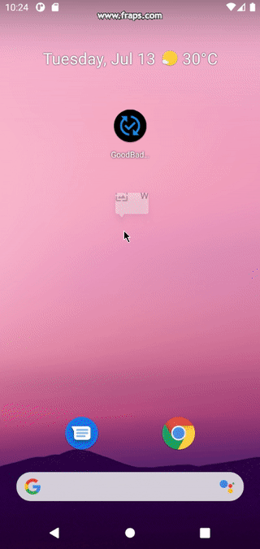
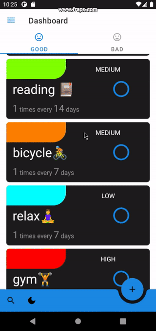
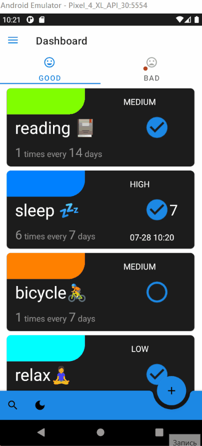

GoodBad Habits 
===================

Implementation of the application using the [Swagger API for Android course](https://droid-test-server.doubletapp.ru/swagger/index.html#/).

### Architecture

* MVVM 
* [Kotlin](https://kotlinlang.org/) 100%, [Coroutines](https://github.com/Kotlin/kotlinx.coroutines),
  [Flow](https://kotlinlang.org/docs/flow.html)

## Preview

### Search

## Libraries

* Di
    * [Dagger 2](https://dagger.dev/)
* Retrofit2 & OkHttp3
    * [Converter: Gson](https://mvnrepository.com/artifact/com.squareup.retrofit2/converter-gson)
    * [Retrofit](https://mvnrepository.com/artifact/com.squareup.retrofit2/retrofit)
    * [OkHttp Logging Interceptor](https://mvnrepository.com/artifact/com.squareup.okhttp3/logging-interceptor)
* Room
    * [Android Room Runtime](https://mvnrepository.com/artifact/androidx.room/room-runtime)
    * [Android Room Kotlin Extensions](https://mvnrepository.com/artifact/androidx.room/room-ktx)
    * [Android Room Compiler](https://mvnrepository.com/artifact/androidx.room/room-compiler)
* Test
    * [JUnit](https://mvnrepository.com/artifact/junit/junit)
    * [Mockito](https://github.com/mockito/mockito)
    * [UI Test Junit4](https://developer.android.com/training/testing/junit-rules)
    * [Espresso](https://developer.android.com/training/testing/espresso)
* Other
    * [Material Components For Android](https://mvnrepository.com/artifact/com.google.android.material/material)
    * [Core Kotlin Extensions](https://developer.android.com/kotlin/ktx#core)
    * [Glide](https://github.com/bumptech/glide)
    * [Navigation Component](https://developer.android.com/guide/navigation/navigation-getting-started)

